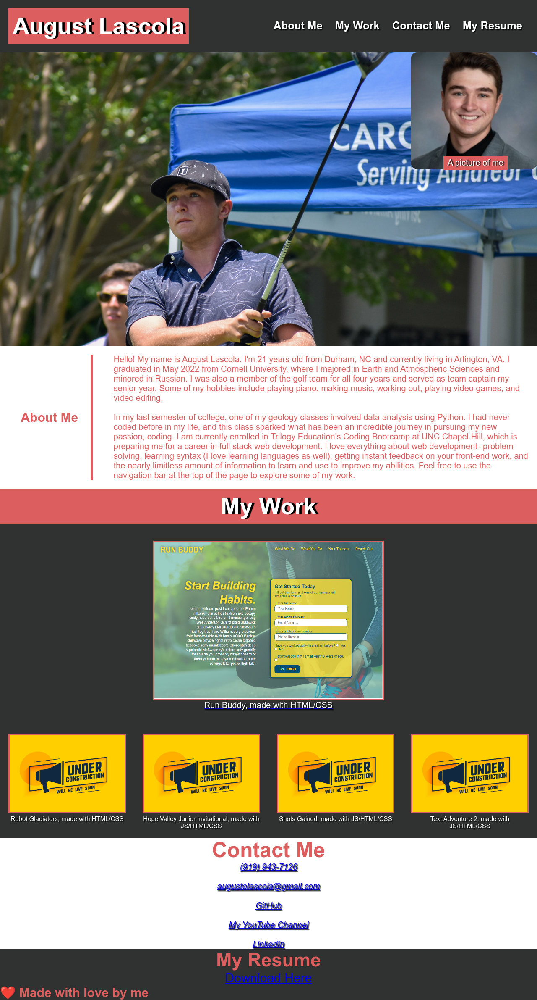

# PortfolioPageV1

This is an early version of my portfolio page that I will be sharing with employers. As of its creation I have a basic grasp of CSS essentials. Patience was learned--also, that "doing" is a far more efficient learning tool than simply watching tutorials. Despite its simplicity I was humbled with the limits of my own knowledge and have gained a lot of motivation to improve upon my shortcomings for the future. 

Only one of the projects is linked to an active page--the large one at the top of the "My Work" section. The others are all projects I have decided to pursue in the coming weeks--they will be linked properly upon their completion. 

The image below shows a screenshot of the deployed site:

### Prerequisites

Nothing--just click on the link in the "Deployment" section below to view the application. 

## Deployment

You can find the finished application at: https://august-lascola.github.io/Horiseon-accessibility/ 

Media queries are brand new to me--I wasn't able to put as much time into perfecting the styling as I would have liked, but resizing the window will show basic functionality. 

## Built With

* [VS CODE] (https://code.visualstudio.com/); my favorite code editor 

## Authors

* August Lascola (https://github.com/August-Lascola)

## Acknowledgments

* Thank you to the instructors and TAs at Trilogy's Coding Bootcamp at UNC for their assistance
* Also, a huge thank you to Billie Thompson (https://github.com/PurpleBooth) for the format of this README file; as a coding noobie it was of great help. 
